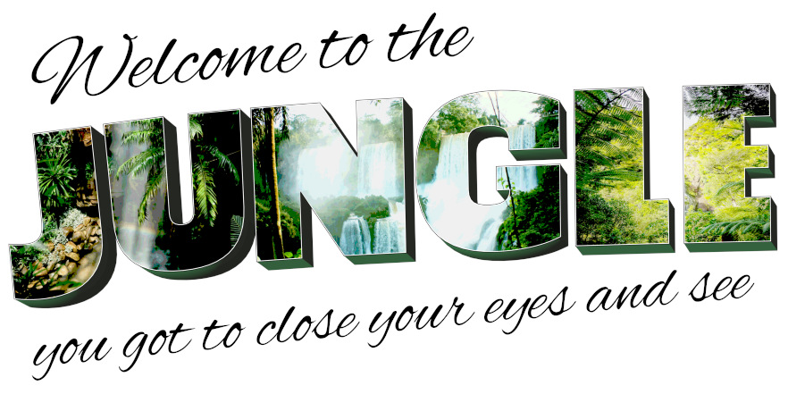

 

Inspired by a loony mix of [_Monk_](https://www.imdb.com/title/tt0312172/), [Pixar's _Cars_](https://www.pixar.com/feature-films/cars) and [_The Witness_](http://the-witness.net/news/) among others, Jungle is a game about a car and its struggles with OCD (and the struggles of the car's owner with the disorder of his beloved vehicle)

## Inspiration
* Monk, Pixar's Cars (Tony Shalhoub - one of his roles has been detective Adrian Monk - borrows his voice to Luigi, the Fiat 500 owning a tire shop in Radiator Springs)
* The Witness for its impressive, atmospheric graphics [see _The Art of The Witness_](http://www.artofluis.com/3d-work/the-art-of-the-witness/) and [this GDC talk](https://www.youtube.com/watch?v=A_Gni_2ecd4)
* isometric games (_Into the Breach_, _Shadowrun Hong Kong_)
* low-poly art (partially _The Witness_) and especially [the art of Filip Ganski](https://filipganski.artstation.com/)
* _Zootopia_ for its lovely build environment
* YouTube channel [_ThinMatrix_](https://www.youtube.com/user/ThinMatrix/videos)
* SketchFab user [_EdwinRC_](https://sketchfab.com/Edwin3D)

[Quote in header image from "Jungle" by Tash Sultana](https://www.youtube.com/watch?v=Vn8phH0k5HI)
